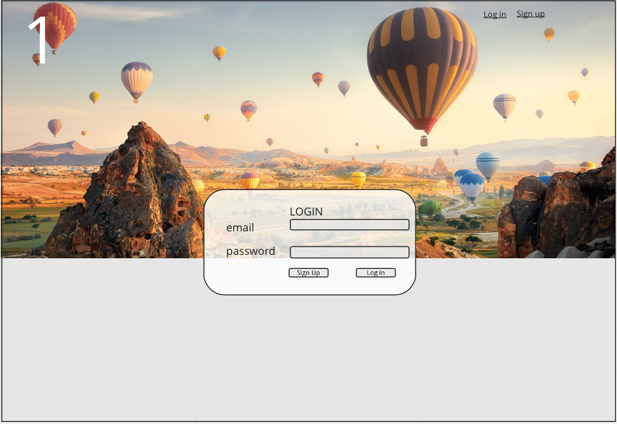

# TRAVEL LOVERS app

## Overview: 

This app allows travellers to plan ahead their travel and see a list of top sightseeing places in any city in the world. It gives information that includes name, description and image of exact place. Users are able to save places they would want to visit.

API to use: https://api.sygictravelapi.com/

## Wireframes:

## User stories:

1. When page loads, I see sign up/login forms.
2. I can create a new profile, or login to an existing profile.
3. If I create a new profile, i need to fill out name, email and password.
4. For an existing profile, i fill out email and password and click Log in.
5. When I successfully logged in, I see welcome header with my name and a search bar.
6. When I search for city, it gives me the list of top sightseeings. Sightseeings contain name, description and image.
7. I can save sightseeings or delete them.

## Routes inventory:

|Method|Path|Description|
|---|---|---|
|POST|/users|create new user|
|POST|/users/login|user login|
|POST|city/search/:city|search by city name|
|POST|city/:userId/save/:cityId|save city into profile|
|DELETE|/users/:userId/delete/:cityId|delete saved city from profile|

## MVP checklist:

* create database
* create models: user and city
* make associations for models
* create routes and controllers
* sign up form
* login form
* profile screen with search bar
* display places
* save function
* delete function
* logout

## Stretch goals:

* save more than one city and show it in a profile page
* add option to search by a category: "sightseeing", "discovering", "nightlife", "hiking", "shopping" and etc